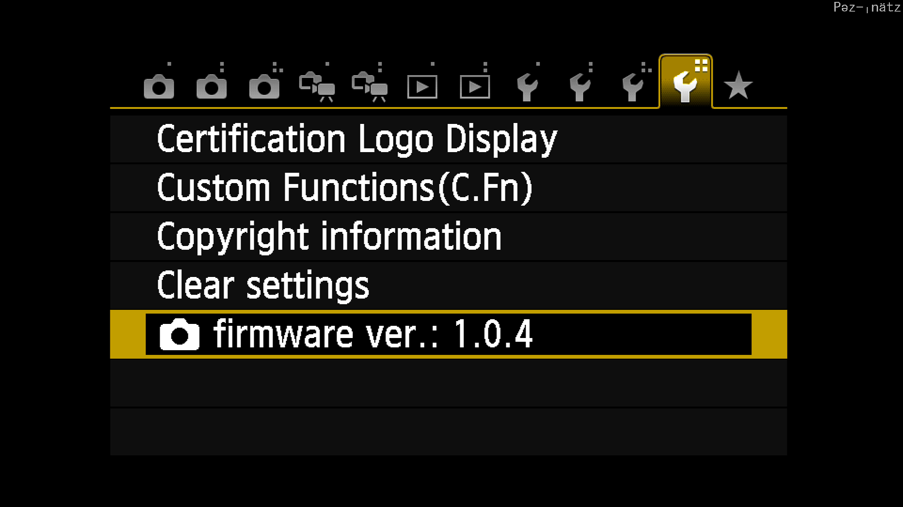
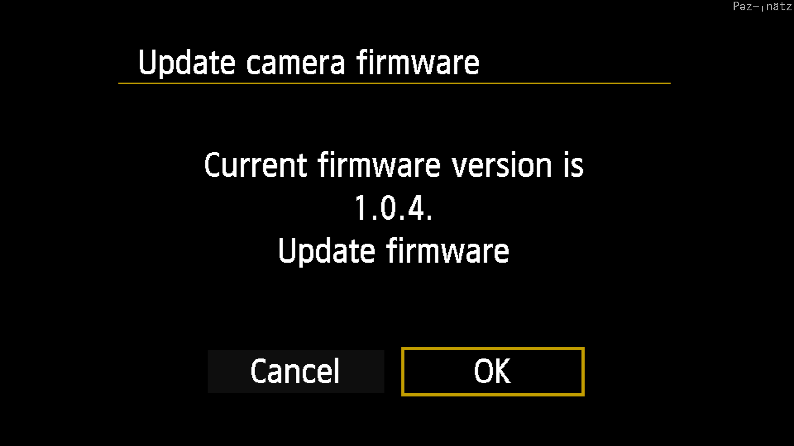
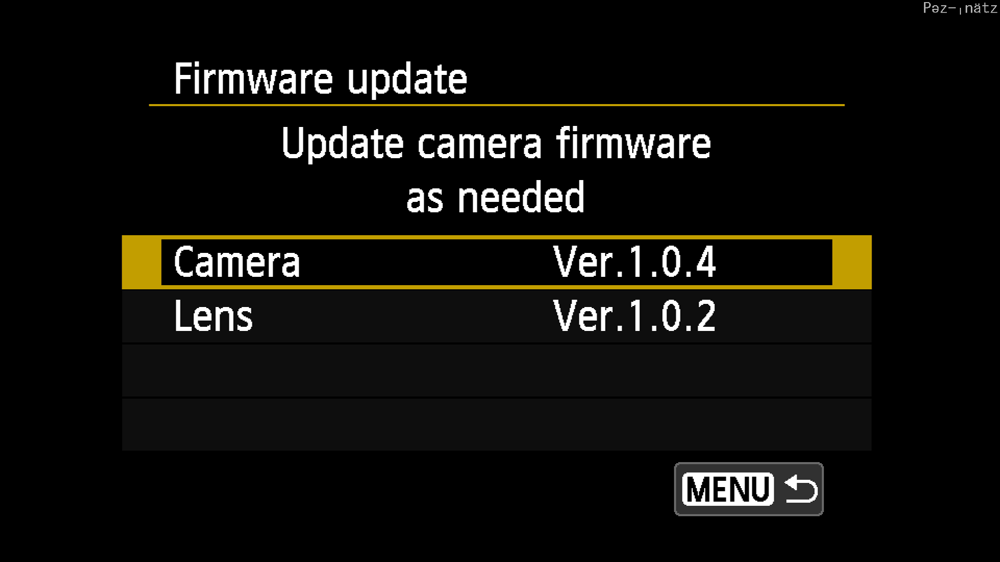
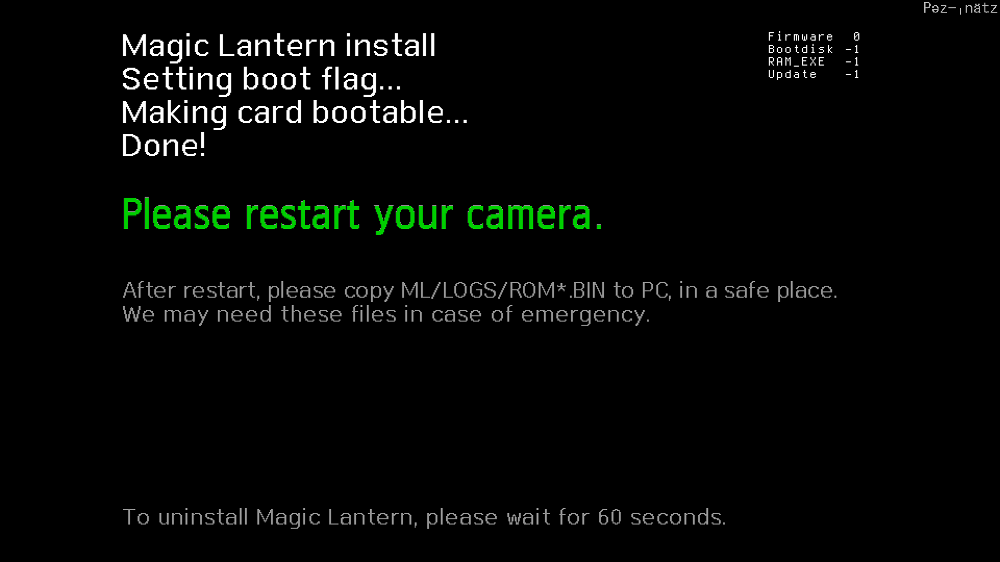
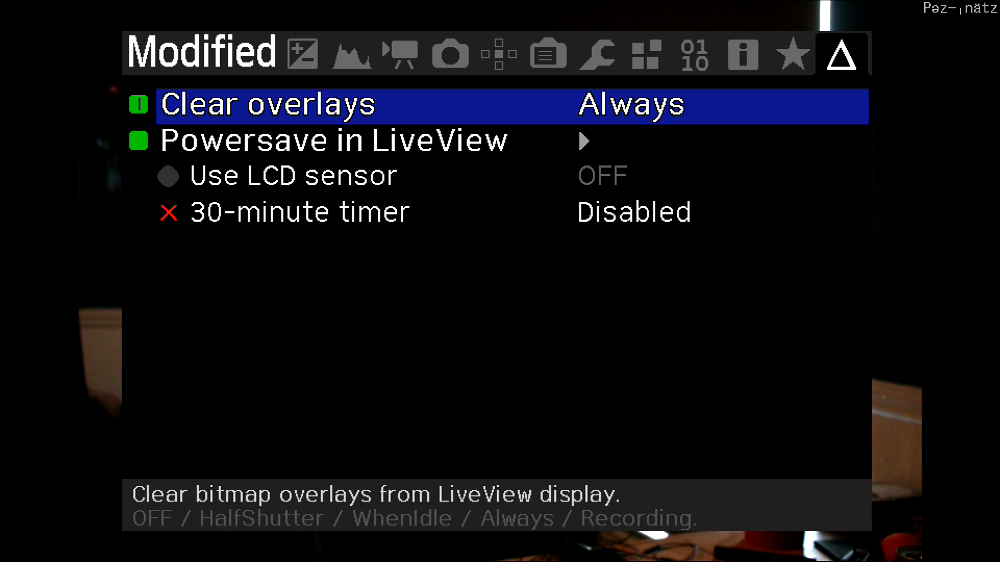

# Canon T4i (650D) Files and Setup for Streaming

To use these files, download and extract the files on to
the SDCard used within your camera.

### Installing Magic Lantern and updated Canon Firmware for the First Time

If your installing the updated canon firmware or the Magic Lantern for the
first time, follow these simple steps.

#### Install the Canon Firmware

The file Canon Firmware file is `CCF13104.FIR` and is version 1.0.4. If your
Camera is not running this version of the firmware, you will need to install
this specific version.

0. To update the canon official firmware, you will need have only **ONE**
   `FIR` file in the root of your SD card at a time. Copy the `CCF13104.FIR`
   file from the `FIRMWARE` directory to the root of the SD card.

1. Install the Canon firmware by setting the mode dial to "P"

2. Turn the power on to the camera.

3. Press the menu button.

4. Go to firmware menu option, click "OK"

   

5. Select the camera option for the firmware update.

   

5. Follow the prompt to update the Canon firmware.

   

#### Install the Magic Lantern

To install Magic Lantern follow these simple steps.

0. If you have just updated the camera to the included Canon Firmware remove
   the `CCF13104.FIR` file from the root directory of the SD card.

1. Copy the `ML-SETUP.FIR` file to the root of the SD card.

2. Install the Canon firmware by setting the mode dial to "P"

3. Turn the power on to the camera.

4. Press the menu button.

5. Go to firmware menu option, click "OK"

   

6. Select the camera option for the firmware update.

   

7. Follow the prompt to update the Canon firmware.

   

8. With the SD Card in the camera, turn the camera on. You should see a screen
   with a prompt that states you need to restart the camera, when you do power
   cycle the camera.

   

### Post Install

Once Magic Lantern is installed you will have an entirely new option menu when
you press the trashcan button on the back of the camera. If you've installed
everything using my provided files, you'll have my exact settings, which I
use for live streaming.

   
